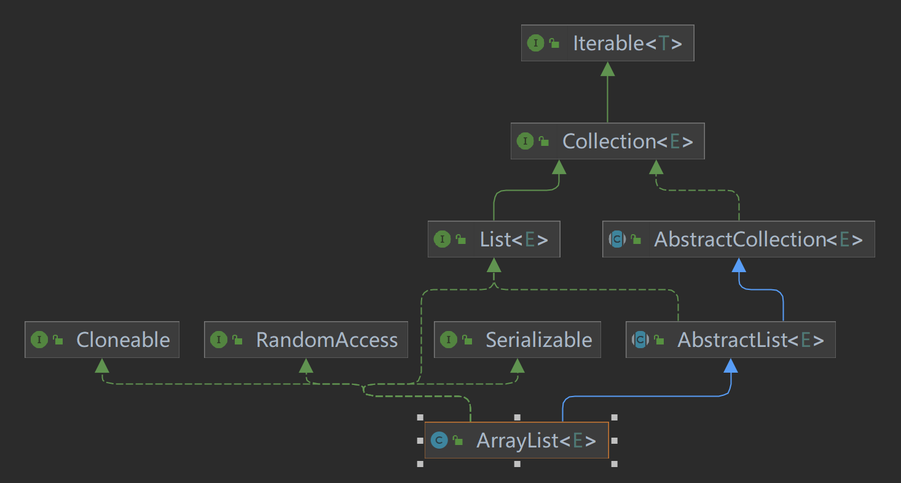

# 抄一个自己的`ArrayList`



## ArrayList源码调试环境搭建

> 先抄后写

1. 复制`AbstractCollection`、`AbstractList` `ArrayList`源码至`com.javaguide.aggregate._01ArrayList.source`包下

2. 将source包下`ArrayList`对`java.util.AbstractList`的引用全部改为引用`com.javaguide.aggregate._01ArrayList.source.AbstractList`

3. 在soure包中的ArrayList构造函数代码中增加控制台打印语句。Test包中编写Chapter01类进行测试

   1. soure包中的ArrayList类

      ```java
       public ArrayList() {
              System.out.println("ArrayList源码调试环境搭建 ");
              this.elementData = DEFAULTCAPACITY_EMPTY_ELEMENTDATA;
          }
      ```

   2. Chapter01类

      ```java
      /**
       * ArrayList源码调试环境搭建
       */
      public class Chapter01 {
          public static void main(String[] args) {
              ArrayList arrayList = new ArrayList();
              //控制台输入--- ArrayList源码调试环境搭建
          }
      }
      ```

      


   

   

   


## ArrayList结构分析

### 实现的接口

> 需要遵守的规范

- Serializable

  - 标记接口，表示启用序列化。（告诉jdk本类可以进行JDK的序列化、反序列化）

    > 序列化和反序列话由jdk实现。
    >
    > 不实现该接口也可以用序列化类库(Jackon、fastJson)转为JSON字符串（String）后，进行序列化

    > serialVersionUID 有什么作用，如何使用 serialVersionUID？
    >
    > serialVersionUID 用于控制序列化版本是否兼容。若我们认为修改的可序列化类是向后兼容的，则不修改 serialVersionUID。
    >
    > **serialVersionUID 是 Java 为每个序列化类产生的版本标识**。它可以用来保证在反序列时，发送方发送的和接受方接收的是可兼容的对象。如果接收方接收的类的 serialVersionUID 与发送方发送的 serialVersionUID 不一致，会抛出 InvalidClassException。
    >
    > 如果可序列化类没有显式声明 serialVersionUID，则序列化运行时将基于该类的各个方面计算该类的默认 serialVersionUID 值。

    > **建议在每一个序列化的类中显式指定 serialVersionUID 的值。因为不同的 jdk 编译很可能会生成不同的 serialVersionUID 默认值**，从而导致在反序列化时抛出 InvalidClassExceptions 异常。

- Cloneable

  - 标记接口，一个类实现了Cloneable接口，以向Object.clone()方法指示该方法可以合法地对该类的实例进行逐个字段的复制。

### 继承的类

> 1. 可直接使用的父类的功能（方法，父类抽取的公共功能，供子类使用）
> 2. 抽象父类定义了一套模板方法，需要子类实现其中的抽象方法

### 拥有的字段

- long serialVersionUID
- 

### 构造方法

### 其他方法

