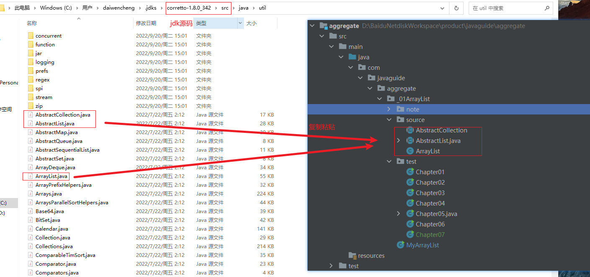
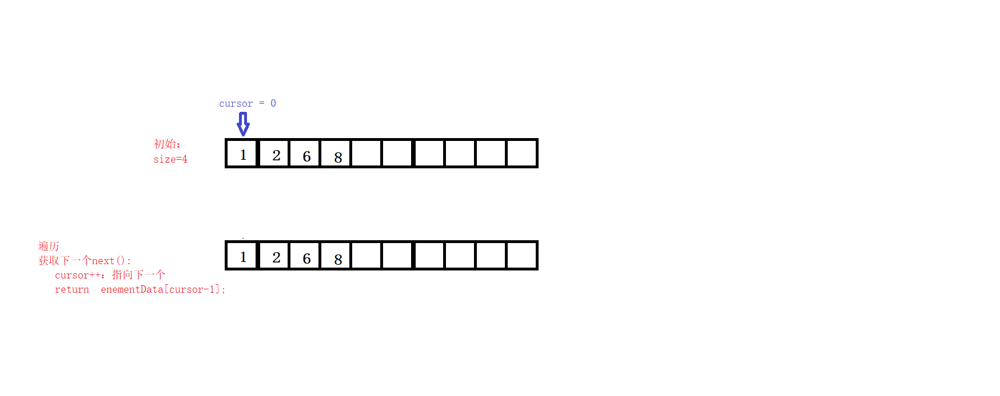
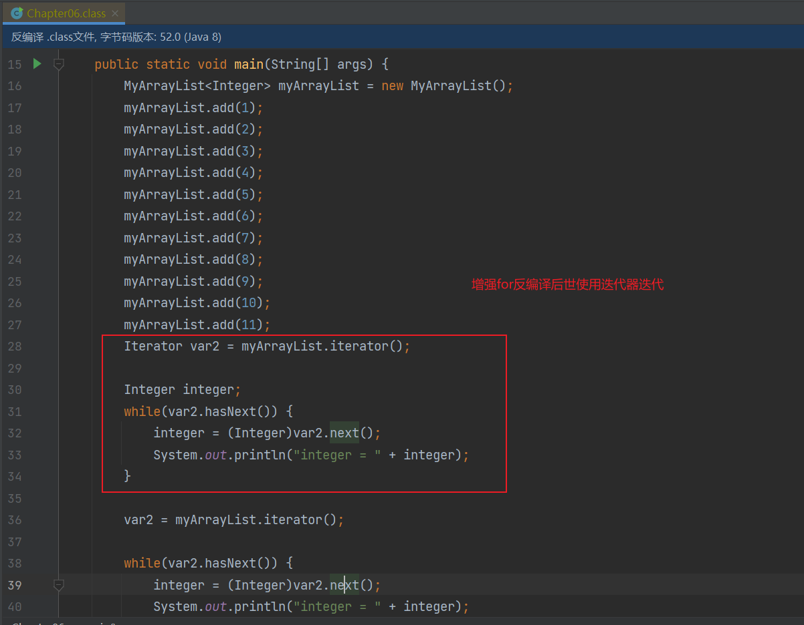
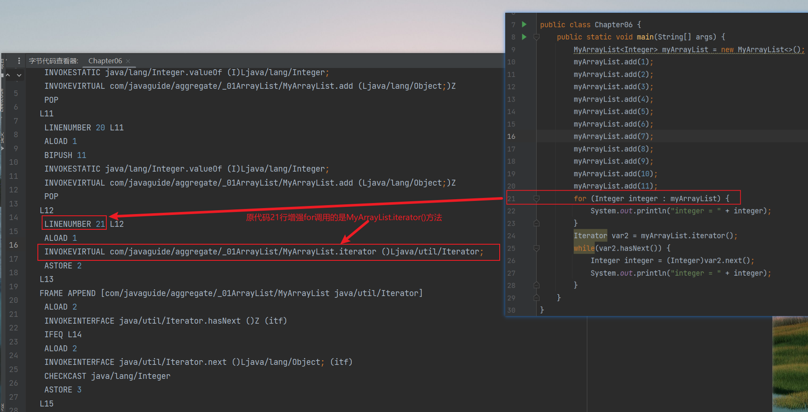
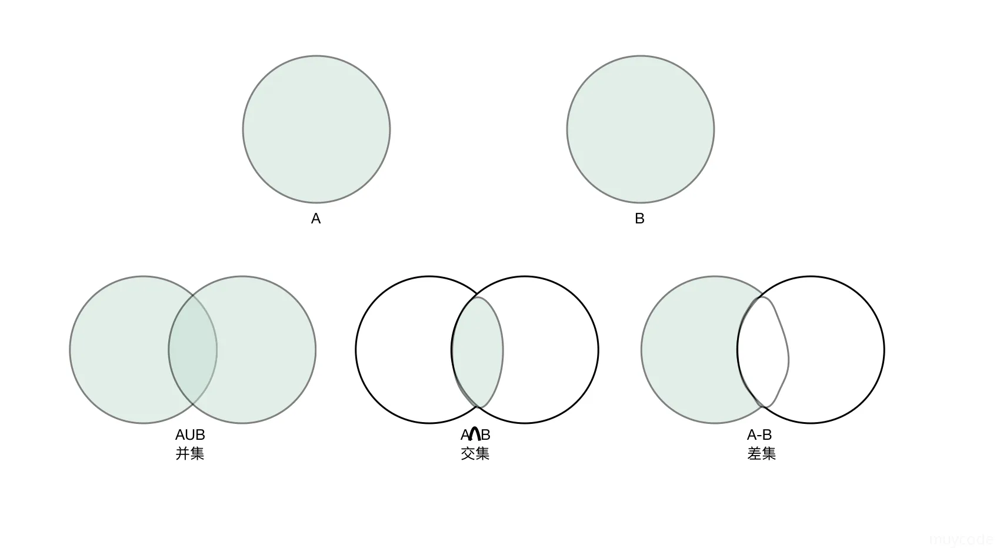
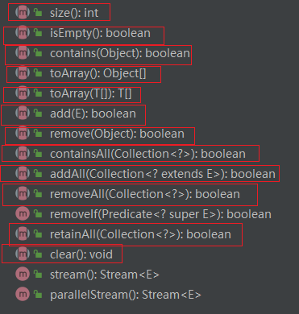

## 01_ArrayList源码调试环境搭建

> 先抄后写

1. 复制`AbstractCollection`、`AbstractList` `ArrayList`源码至`com.javaguide.aggregate._01ArrayList.source`包下

    

2. 将source包下`ArrayList`对`java.util.AbstractList`的引用全部改为引用`com.javaguide.aggregate._01ArrayList.source.AbstractList`

3. 在soure包中的ArrayList构造函数代码中增加控制台打印语句。Test包中编写Chapter01类进行测试

    1. soure包中的ArrayList类

       ```java
        public ArrayList() {
               System.out.println("ArrayList源码调试环境搭建 ");
               this.elementData = DEFAULTCAPACITY_EMPTY_ELEMENTDATA;
           }
       ```

    2. Chapter01类

       ```java
       /**
        * ArrayList源码调试环境搭建
        */
       public class Chapter01 {
           public static void main(String[] args) {
               ArrayList arrayList = new ArrayList();
               //控制台输入--- ArrayList源码调试环境搭建
           }
       }
       ```

      

## 02_实现一个简单的能存取数据的List

- [ ] 存放数据的缓冲区（字段：`Object[] elementData`）
- [ ] 描述缓冲区数据数目的多少（字段：`int size`）
- [ ] 存一个数据的功能（方法：add(E e)）
- [ ] 取一个数据的功能（方法：get(int index)）

1. 新建一个MyArrayList类

2. Chapter02类

   1. 测试add和get方法


## 03_实现自动扩容

### 一、目标

- 数组中元素满时完成自动扩容

### 二、设计
- add(E e)中的扩容
  - 尾插法，当数组容量满时创建新数组进行扩容。将新老数组元素复制到新数组中
    .png)
- add(int index, E element)中的扩容
  - 指定索引位进行数据插入
      .webp)
  
### 三、详细目标
- 主要功能

- [ ] add(E e)中的扩容
- [ ] add(int index, E element)中的扩容

- 其他功能

- [ ] MyArrayList()
  
  - 无参构造
  
  - 使用无参构造进行数组懒初始化（扩容时再初始化数组位默认容量）
  
- [ ] MyArrayList(int initialCapacity)

  - 创建List时可指定初始化数组容量

- [ ] MyArrayList(MyArrayList<E> c) 

- [ ] addAll(MyArrayList<E>  c) （选做）
- [ ] addAll(int index, MyArrayList<E> c) （选做）
### 四、实现

见git commit节点 `03_实现自动扩容`代码

### 五、测试

见`Chapter03`类中代码

- SystemArraycopyTest1()
  - System.arraycopy() API测试
- ArraysCopyOfTest()
  - Arrays.copyOf() API测试
- autoExpansionTest1()
  - 测试add(E e) 中触发自动扩容
- autoExpansionTest2()
  - add(int index, E element) 中触发自动扩容
- autoExpansionTest3()
  - 测试addAll(MyArrayList<E>  c)中触发自动扩容
- autoExpansionTest4()
  - 测试addAll(int index, MyArrayList<E> c)中触发自动扩容

### 六、问题

- Q1：用户创建MyArrayLis不指定容量时，是否立即分配默认容量？

- Q2：数据达到该数组容量上限之后是否每添加一个元素就进行一次扩容？

- Q3:   是否可以无限制扩容，MyArrayLis可达的最大容量是多少？

- Q4：达到最大容量上限后，再次添加元素会怎样？

- Q5：每次扩容，扩容了多少倍？

- Q6：ArrayList扩容的时机是什么时候？

- Q7：为什么ArrayList没有loadFactor，不像HashMap一样数据达到数组⼤⼩*loadFactor时就开始扩容？

- Q8：当数组容量远大于实际元素大小时，ArrayList是否会进行容量缩减？

- Q9：为什么建议arraylist创建时指定容量大小？


### 七、重点

1. ArrayLis的扩容机制
2. 熟悉`System.arraycopy()`和 `Arrays.copyOf` API的使用


## 04_实现自定义序列化
### 一、目标

- 使ArrayList支持序列化
- 自定义elementData的序列化

### 二、设计

- implements Serializable接口对象方可序列化
- 使用`writeObject(ObjectOutputStream s)`和`readObject(ObjectInputStream s)`来实现自定义MyArrayList中的数组元素序列化，缩减elementData所需序列化的数据

### 三、详细目标

- [ ] 显式指定 serialVersionUID 的值

  - 因为不同的 jdk 编译很可能会生成不同的 serialVersionUID 默认值，所以建议显式指定 serialVersionUID 的值

- [ ] Object[] elementData字段自定义序列化

  - 只序列化实际存储的那些元素，而不是整个数组，从而节省空间和时间

  - [ ] 自定义writeObject(java.io.ObjectOutputStream s)方法
  - [ ] 自定义readObject(java.io.ObjectInputStream s)方法

### 四、实现

见git commit节点 `04_实现自定义序列化`代码

### 五、测试

见`Chapter04`类中代码`serializationTest()`

- 测试用例
  
  未自定义序列化时:
  
  - 1.使用transient修饰字段Object[] elementData时测试
  
  - 2.不使用transient修饰字段Object[] elementData时测试
  
  自定义序列化后（新增writeObject、readObject方法）：
  
  - 3.使用transient修饰字段Object[] elementData时测试
  - 4.不使用transient修饰字段Object[] elementData时测试

### 六、问题

- Q1：ArrayList为何要实现自定义序列化？

- Q2：自定义的`writeObject(ObjectOutputStream s)`和`readObject(ObjectInputStream s)`是何时被触发的？
- Q3：自定义writeObject和readObject因注意哪些地方？


### 七、重点

1. 自定义对象序列化流程
2. 注意writeObject和readObject方法中数据的读写顺序以及数目


## 05_实现对象克隆

### 一、目标

- 使ArrayList支持对象克隆

### 二、设计

- implements Cloneable接口以支持`Object.clone()`
  - Cloneable为标记接口，未implements Cloneable接口时调用`Object.clone()`会触发`java.lang.CloneNotSupportedException`异常

- 重写`Object.clone()`方法以实现自定义克隆和赋予更大的方法访问权限
  - 自定义克隆，重新生成elementData以缩减数组占用空间
  - 赋予public方法访问权限，以使外部对象有使用该方法的权限


### 三、详细目标

- [ ] implements Cloneable

- [ ] 重写`Object.clone()`方法
  - 赋予更大的public方法访问权限
  - 对`elementData`复制时只复制数组实际拥有的元素（生成新数组，数组中的元素仍然是引用原元素地址（浅克隆））

### 四、实现


见git commit节点 `05_实现对象克隆`代码

### 五、测试

见`MyArrayList`类中方法`objectCloneInThisTest()`

见`Chapter05`类中方法`objectCloneTest()`

- 测试用例

  在`MyArrayList`中测试:

  - 1.测试未implements Serializable接口使用Object.clone()方法进行对象克隆场景

  - 2.测试implements Serializable接口但未重写Object.clone()方法进行对象克隆场景

  在`Chapter05`中测试：

  - 3.测试重写`Object.clone()`但未使用`Arrays.copyOf()`复制`elementData`进行克隆对象后，再进行`add()`操作的场景
  - 4.测试重写`Object.clone()`并使用`Arrays.copyOf()`复制`elementData`进行克隆对象后，再进行`add()`操作的场景
  - 5.测试重写`Object.clone()`并使用`Arrays.copyOf()`复制`elementData`进行克隆对象后，再进行元素对象属性修改的场景

### 六、问题

- Q1：`Object.clone()`属于深克隆还是浅克隆？
- Q2：`ArrayList`对象克隆的过程是怎样的？

### 七、重点

1. 对象克隆的实现方式
2. 深克隆和浅克隆
3. `ArrayList`对象克隆的过程


## 06_实现顺序遍历

### 一、目标

- 使ArrayList支持顺序遍历

### 二、设计

- implements Iterable接口以支持顺序遍历
  - 支持for-each 语句（增强for）
  - 支持显示Iterator迭代
  - 支持forEach()函数（since java1.8）
  - 支持Spliterator迭代（并行遍历）（**本章不考虑**）

- 自定义Iterator
  - 实现顺序遍历
  - 增强for语法实际调用的是Iterator进行迭代
  - 以响应 Iterable接口中iterator()的要求

- 迭代过程
  - cursor：顺序遍历，使用cursor记录遍历到了哪一位置(cursor-1)
    

### 三、详细目标

- [ ] implements Iterable

- [ ] 重写`iterator()`方法
  - 返回内部类实现`Itr`
- [ ] 自定义`Iterator`的内部类实现`Itr`
  - `hasNext()`
  - `next()`

### 四、实现

见git commit节点 `06_实现顺序遍历`代码

- 增强for使用的是Iterator进行实现

  - 原始代码

     

  - 反编译class得到的代码
  
  
  - 字节码文件
    
    

### 五、测试

见`Chapter06`类中方法`main()`

- 测试用例

  - 1.测试增强for能否正常使用
  - 2.测试使用自定义迭代器迭代能否正常使用
  - 3.测试多线程环境下触发`java.util.ConcurrentModificationException`异常场景（未写）

### 六、问题

- Q1：Iterable和Iterator有什么区别？
- Q2：增强for语法糖机制？和fori的区别？

### 七、重点

1. 了解Iterable和Iterator的区别
1. 学会使用游标进行顺序遍历
1. 了解增强for的机制

### 八、补充-impl RandomAccess

- RandomAccess
  - 标记接口，`List`实现使用的标记接口表明它们支持快速（通常是恒定时间）随机访问

	> 告诉别人我这个List支持随机访问，直接fori gei(i)就行

- RandomAccess的使用方式

  - 如果list instanceof RandomAccess ，则使用随机访问遍历，否则顺序遍历

  ```java
      private static void list(List<Integer> list) {
          if (list instanceof RandomAccess) {
              for (int i = 0; i < list.size(); i++) {
                  Integer integer = list.get(i);
                  System.out.println("integer = " + integer);
              }
          }else {
              for (Integer integer : list) {
                  System.out.println("integer = " + integer);
              }
          }
      }
  ```

  - 测试代码

    ```java
        private static void randomAccessTest() {
            List<Integer> list = new ArrayList<>();
            list.add(1);
            list.add(2);
            list.add(3);
            list.add(4);
            list(list);
            List<Integer> linkedList = new LinkedList<>();
            linkedList.add(1);
            linkedList.add(2);
            linkedList.add(3);
            linkedList.add(4);
            list(linkedList);
    
        }
    ```

    


## 07_implement Collection

### 一、目标

- ArrayList实现Collection接口

### 二、设计

 - 集合间的关系

   

- Collection规范（需要实现类重写的方法）

  

  - **添加元素**

    - `add(E e)`：添加元素对象到当前集合中

    - `addAll(Collection<? extends E> c)`：添加other集合中的所有元素对象到当前集合中，即this = this ∪ other。*求并集*。

  - **删除元素**

    - `remove(Object o)`：从当前集合中删除第一个找到的与obj对象equals返回true的元素。

    - `removeAll(Collection<?> c)`：从当前集合中删除所有与coll集合中相同的元素。即this = this - this ∩ coll。*移除交集*。

    - `clear()`：从此集合中移除所有元素（可选操作）。此方法返回后，集合将为空。

    - `retainAll(Collection<?> coll)`：仅保留此集合中包含在指定集合中的元素（可选操作）。换句话说，从这个集合中移除所有不包含在指定集合中的元素。求交集，即this = this ∩ coll；

  - **判断元素**

    - `isEmpty()`：判断当前集合是否为空集合。

    - `contains(Object o)`：判断当前集合中是否存在一个与obj对象equals返回true的元素。

    - `containsAll(Collection<?> c)`：判断c集合是否是当前集合的“子集”。c集合中的元素是否在当前集合中都存在。

  - **集合转数组**

    - `Object[] toArray()`：返回包含当前集合中所有元素的`Object`类型数组

      - `Object`类型数组强制转换为其他类型数组大概率会失败

    -  `T[] toArray(T[] a)`：返回包含当前集合中所有元素的`T`类型数组

      - `T`类型必须是`Collection<E>`中`E`类型或者`E`类型的超类，否则抛出`ArrayStoreException`异常

      - 推荐用法示例
  
        ```java
                Collection<String> coll = new ArrayList<>();
                coll.add("aa");
                String[] array = new String[coll.size()];
                coll.toArray(array);
        		//数据已经从coll复制到了array
                System.out.println("array = " + array);
        ```

  - **获取集合中元素个数**
  
    - `size()`：获取当前集合中实际存储的元素个数
    
  - **获取迭代器**
  
    - iterator()：获取迭代器，继承自`Iterable`的功能，用于支持迭代和增强的 for 语句
  
- ***快速失败（fail-fast）机制***迭代期间ArrayList结构上被修时迭代器将抛出`ConcurrentModificationException`

  > 如果在Iterator、ListIterator迭代器创建后的任意时间从结构上修改了集合（通过迭代器自身的 remove 或 add 方法之外的任何其他方式），则迭代器将抛出 ConcurrentModificationException。因此，面对并发的修改，迭代器很快就完全失败，而不是冒着在将来不确定的时间任意发生不确定行为的风险。

  > 注意，迭代器的快速失败行为不能得到保证，一般来说，存在不同步的并发修改时，不可能作出任何坚决的保证。快速失败迭代器尽最大努力抛出 ConcurrentModificationException。因此，编写依赖于此异常的程序的方式是错误的，正确做法是：*迭代器的快速失败行为应该仅用于检测单线程情况下的 bug

  - 记录ArrayList结构上被修改次数`modCount`

  - 在迭代期间应用`modCount`，防止出现不正确迭代
  - 在结构上修改时记录`modCount`
  


### 三、详细目标

- [ ] implements Collection
- [ ] 实现Collection规范（重写需要实现类重写的方法）
  - **添加元素**
    - [ ] `add(E e)`

    - [ ] `addAll(Collection<? extends E> c)`

  - **删除元素**
    - [ ] `remove(Object o)`

    - [ ] `removeAll(Collection<?> c)`

    - [ ] `clear()`

    - [ ] `retainAll(Collection<?> coll)`

  - **判断元素**
    - [ ] `isEmpty()`
    
    - [ ] `contains(Object o)`
    
    - [ ] `containsAll(Collection<?> c)`
    
  - **集合转数组**
    - [ ] `Object[] toArray()`
    
    - [ ] `T[] toArray(T[] a)`
    
  - **获取集合中元素个数**
    - [ ] `size()`
- [ ] 完善迭代期间ArrayList结构上被修改产生的问题


### 四、实现


见git commit节点 `07_implement Collection`代码

### 五、测试

- 测试用例
  - 测试上述所有 `Collection`接口所有的方法
  - fail-fast测试

### 六、问题

- Q1:  `Collection`的功能是什么，主要规定了哪些接口规范？
- Q2: `Collection`和Array有怎样的区别？
- Q3: `Collection`如何转数组？怎样写比较好？
- Q4:   `ArrayList`如何实现求两个集合的交集的？
  - tips：读写双指针算法

- Q5： `ArrayList`如何实现快速失败（fail-fast）机制的？
- Q6: fail-fast能否检查出并发情况下迭代时对 `ArrayList`结构上的修改？

### 七、重点

1. 集合间基本关系
1. Collection规范（需要实现类重写的方法）
1. 使用读写双指针算法完成求交集和交集的补集
1. `modCount`实现快速失败（fail-fast）机制


